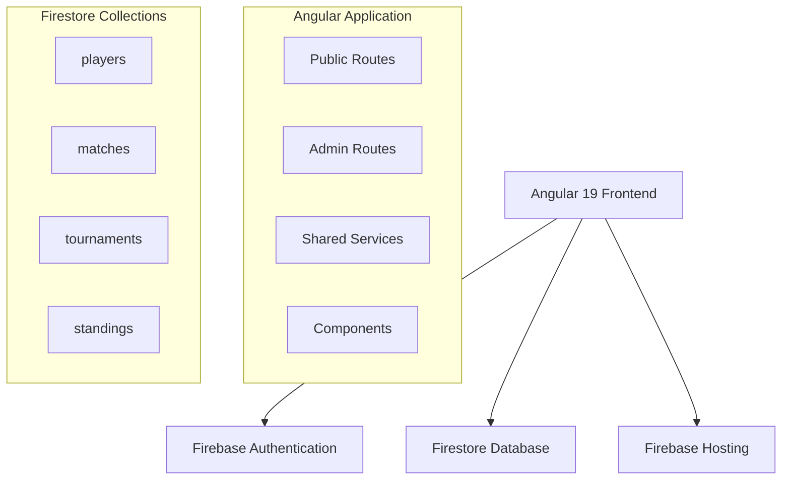

# Design Document

## Overview

The eFootball Tournament Manager is a single-page application (SPA) built with Angular 19 that provides tournament management capabilities for league-style competitions. The application uses Firebase Authentication for admin security and Firestore for real-time data storage and synchronization. The system is designed with a clear separation between public viewing interfaces and administrative management functions.

## Architecture

### High-Level Architecture



### Technology Stack

- **Frontend**: Angular 19 with TypeScript
- **Backend**: Firebase (Firestore for database, Authentication for admin access)
- **Styling**: Angular Material or Bootstrap for responsive UI
- **State Management**: Angular Services with RxJS Observables
- **Routing**: Angular Router with route guards for admin protection

## Components and Interfaces

### Core Components

#### Public Components

1. **ScheduleComponent** - Displays match schedules organized by matchdays
2. **StandingsComponent** - Shows the points table with player statistics
3. **HomeComponent** - Landing page with navigation to schedules and standings
4. **HeaderComponent** - Navigation bar with links to public pages

#### Admin Components

1. **AdminLoginComponent** - Authentication interface for admin access
2. **PlayerManagementComponent** - Add/edit/remove players
3. **ScheduleGeneratorComponent** - Generate tournament schedules
4. **MatchResultsComponent** - Enter match scores and results
5. **AdminDashboardComponent** - Overview of tournament status

### Data Models

#### Player Interface

```typescript
interface Player {
  id: string;
  name: string;
  createdAt: Date;
  isActive: boolean;
}
```

#### Match Interface

```typescript
interface Match {
  id: string;
  homePlayerId: string;
  awayPlayerId: string;
  homePlayerName: string;
  awayPlayerName: string;
  matchday: number;
  homeGoals?: number;
  awayGoals?: number;
  isPlayed: boolean;
  isPlayoff: boolean;
  playoffRound?: "semifinal" | "final" | "third-place";
  createdAt: Date;
}
```

#### Tournament Interface

```typescript
interface Tournament {
  id: string;
  name: string;
  status: "setup" | "league" | "playoffs" | "completed";
  playerIds: string[];
  currentMatchday: number;
  totalMatchdays: number;
  createdAt: Date;
}
```

#### Standing Interface

```typescript
interface Standing {
  playerId: string;
  playerName: string;
  matchesPlayed: number;
  wins: number;
  draws: number;
  losses: number;
  goalsFor: number;
  goalsAgainst: number;
  goalDifference: number;
  points: number;
  position: number;
}
```

### Services Architecture

#### PlayerService

- Manages CRUD operations for players
- Validates minimum player requirements
- Provides real-time player list updates

#### MatchService

- Generates round-robin schedules
- Manages match results entry
- Calculates match statistics
- Handles playoff bracket generation

#### StandingsService

- Calculates and updates player standings
- Sorts players by points and goal difference
- Provides real-time standings updates

#### TournamentService

- Manages tournament lifecycle
- Coordinates between other services
- Handles tournament state transitions

#### AuthService

- Manages Firebase Authentication
- Provides admin route protection
- Handles login/logout functionality

## Data Models

### Firestore Collections Structure

#### players Collection

```json
{
  "playerId": {
    "name": "string",
    "createdAt": "timestamp",
    "isActive": "boolean"
  }
}
```

#### matches Collection

```json
{
  "matchId": {
    "homePlayerId": "string",
    "awayPlayerId": "string",
    "homePlayerName": "string",
    "awayPlayerName": "string",
    "matchday": "number",
    "homeGoals": "number | null",
    "awayGoals": "number | null",
    "isPlayed": "boolean",
    "isPlayoff": "boolean",
    "playoffRound": "string | null",
    "createdAt": "timestamp"
  }
}
```

#### tournaments Collection

```json
{
  "tournamentId": {
    "name": "string",
    "status": "string",
    "playerIds": "array",
    "currentMatchday": "number",
    "totalMatchdays": "number",
    "createdAt": "timestamp"
  }
}
```

### Data Relationships

- Players have a one-to-many relationship with matches (as home or away player)
- Tournaments contain references to player IDs
- Standings are calculated dynamically from match results
- Playoff matches are linked to league standings through player rankings

## Error Handling

### Client-Side Error Handling

1. **Form Validation**

   - Player name required validation
   - Minimum 5 players for tournament generation
   - Score entry validation (non-negative integers)

2. **Network Error Handling**

   - Offline detection and user notification
   - Retry mechanisms for failed Firestore operations
   - Loading states during data operations

3. **Authentication Errors**
   - Invalid login credentials handling
   - Session timeout management
   - Unauthorized access redirects

### Server-Side Error Handling

1. **Firestore Security Rules**

   - Read access for public data (matches, standings)
   - Write access restricted to authenticated admin users
   - Data validation at the database level

2. **Data Integrity**
   - Prevent duplicate player names
   - Ensure match results are within valid ranges
   - Maintain referential integrity between collections

## Testing Strategy

### Unit Testing

- **Services**: Test business logic for schedule generation, standings calculation, and data operations
- **Components**: Test component behavior, form validation, and user interactions
- **Pipes**: Test custom pipes for data formatting and filtering

### Integration Testing

- **Firebase Integration**: Test Firestore operations and authentication flows
- **Component Integration**: Test communication between parent and child components
- **Service Integration**: Test coordination between multiple services

### End-to-End Testing

- **User Workflows**: Test complete user journeys from player registration to tournament completion
- **Admin Workflows**: Test admin functions including player management and score entry
- **Cross-Browser Testing**: Ensure compatibility across different browsers and devices

### Testing Tools

- **Unit Tests**: Jasmine and Karma (Angular defaults)
- **E2E Tests**: Cypress or Protractor
- **Firebase Testing**: Firebase Emulator Suite for local testing

## Security Considerations

### Authentication and Authorization

- Firebase Authentication for admin access
- Route guards to protect admin routes
- Firestore security rules to prevent unauthorized data access

### Data Security

- Input sanitization for player names and scores
- Validation of numeric inputs to prevent injection attacks
- Secure handling of authentication tokens

### Privacy

- No personal information stored beyond player names
- Optional avatar upload feature excluded from MVP for simplicity
- Public access to tournament data is intentional for transparency

## Performance Considerations

### Frontend Optimization

- Lazy loading for admin modules
- OnPush change detection strategy for performance
- Efficient data binding and minimal DOM manipulation

### Backend Optimization

- Firestore indexes for efficient querying
- Real-time listeners only where necessary
- Batch operations for bulk data updates

### Caching Strategy

- Browser caching for static assets
- Service worker for offline functionality (future enhancement)
- Local storage for temporary data caching
